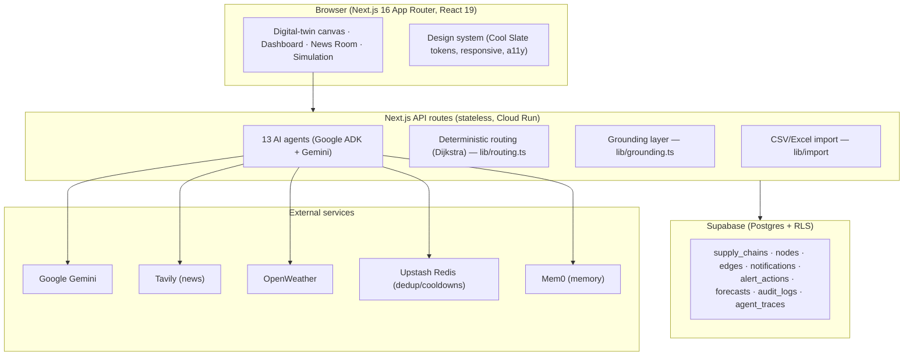

# REROUTE — Architecture & Scaling

**REROUTE** = *Risk Evaluation & Route Optimization Using Twin Emulation.* An
AI-agent-native supply-chain control tower: model your network as a digital twin,
let autonomous agents surface grounded risks, and act on them (reroute / mitigate /
resolve) — with the **math done deterministically** and the **LLM used only to
explain**.

---

## 1. System overview



## 2. Layers

- **Frontend** — Next.js App Router, React 19, a design-system (`app/globals.css`
  tokens + `tailwind.config.ts`), React Flow canvas, Leaflet/simple-maps, Recharts.
  Fully responsive + accessibility (skip-link, focus rings, `aria-label`s,
  reduced-motion).
- **API / agents** — stateless route handlers under `app/api/`. Thirteen agents
  via Google ADK; each execution wrapped in `withTrace()` → `agent_traces`, and
  audited via `logAudit()` → `audit_logs`.
- **Deterministic core** — routing (`lib/routing.ts`, Dijkstra) and grounding
  (`lib/grounding.ts`) are pure, unit-tested TypeScript. The LLM never invents the
  numbers; it writes the narrative.
- **Data** — Supabase Postgres with **Row Level Security** scoping every row to
  its `user_id`. Upstash Redis for dedup/cooldowns; Mem0 for longitudinal memory.

## 3. Key design decisions

| Decision | Why |
|---|---|
| **Deterministic routing + grounded AI** | Reroutes/impacts are computed (Dijkstra, cost/time) and every AI claim carries confidence + sources + a "needs review" flag — auditable, not hallucinated. |
| **Stateless API routes** | Horizontal autoscaling on Cloud Run with no session affinity. |
| **RLS-first data model** | Multi-tenant isolation enforced in the database, not just the app. |
| **Pure, tested core libs** | `buildTwin`, `getGrounding`, `rerouteAroundNode` are pure → 23 unit tests, safe to evolve. |
| **Multi-key LLM quota routing** | `GOOGLE_API_KEY_*` per module spreads quota; agents fall back to playbooks on 429. |

## 4. Scaling strategy

**Today (handles real usage):**
- **Stateless compute** → Cloud Run scales horizontally (0→N instances) with
  concurrency packing; all state is in Postgres.
- **Deterministic routing** is in-process `O(V·E)` Dijkstra — sub-millisecond on
  realistic twins, **zero external calls**, so reroute latency is independent of
  LLM load.
- **RLS + Supabase connection pooler** → many tenants on one Postgres without
  per-request auth logic; pooler absorbs connection spikes.
- **Upstash Redis** provides distributed dedup + cooldowns so duplicate work is
  suppressed across instances.
- **LLM cost/latency control** — the LLM is used only for narrative; math is
  local. Multi-key routing + rate-limit playbook fallbacks keep uptime at 100%.

**Next steps for larger scale (documented, prioritized):**
1. **Durable job queue** (Upstash QStash / Cloud Tasks) for the autonomous
   scanners — replaces per-instance in-memory timers with idempotent workers +
   DB-timestamp cooldowns, so scans are correct across many instances/restarts.
2. **Read replicas / materialized views** for dashboard aggregates as tenant count grows.
3. **Prompt caching + response cache** (Redis) for repeated intelligence queries.
4. **Per-tenant rate limiting & budget caps** on LLM spend.

**Known bottlenecks & mitigations:**

| Bottleneck | Mitigation |
|---|---|
| Autonomous agents use in-memory cooldowns | Move to a durable queue (item 1 above) |
| LLM latency/quota | Deterministic core + multi-key routing + fallbacks + caching |
| Dashboard aggregate queries | Indexes + materialized views + Redis cache |
| Cold starts (scale-to-zero) | `min-instances 1` for latency-sensitive prod |

## 5. Repository map

```
app/            Routes: (main) app screens, api/agent/* (13 agents), api/*
components/     UI: digital-twin (canvas/panels), dashboard, simulation,
                news-room, profile, motion primitives, design-system ui/*
lib/            routing.ts, grounding.ts, import/, ai-config, supabase, adk/,
                actions/, stores/
tests/          Vitest unit tests (import, grounding, routing) — 23 tests
docs/           ARCHITECTURE.md, DEPLOYMENT.md, PRODUCTION_ROADMAP.md, specs/
```
